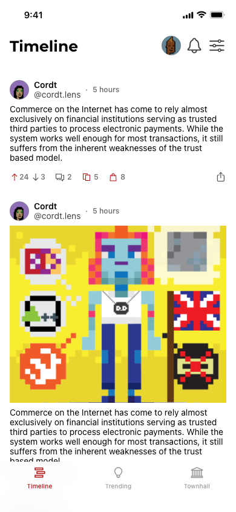
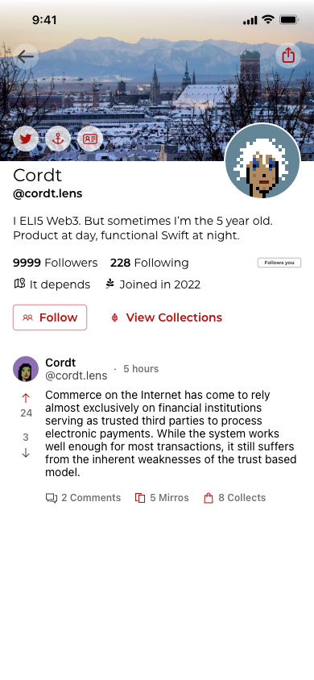
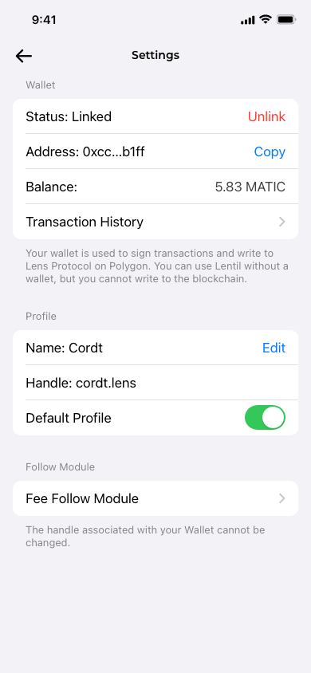

# Lentil

## Overview
Lentil is a native iOS Client for Lens Protocol. It does not aim to be a clone of Twitter, YouTube or others, but instead to showcase and explore the full set of functionalitites, as offered by the protocol.
The app is built using 
* [The Composable Architecture](https://github.com/pointfreeco/swift-composable-architecture) as the core architecture of the app
* [SwiftUI](https://developer.apple.com/xcode/swiftui/) for the interface
* [Web3.swift](https://github.com/argentlabs/web3.swift) to handle the wallet integration

## Target UI
Timeline                   |  Profile.                 |  Settings 
:-------------------------:|:-------------------------:|:-------------------------:
  |   | 
